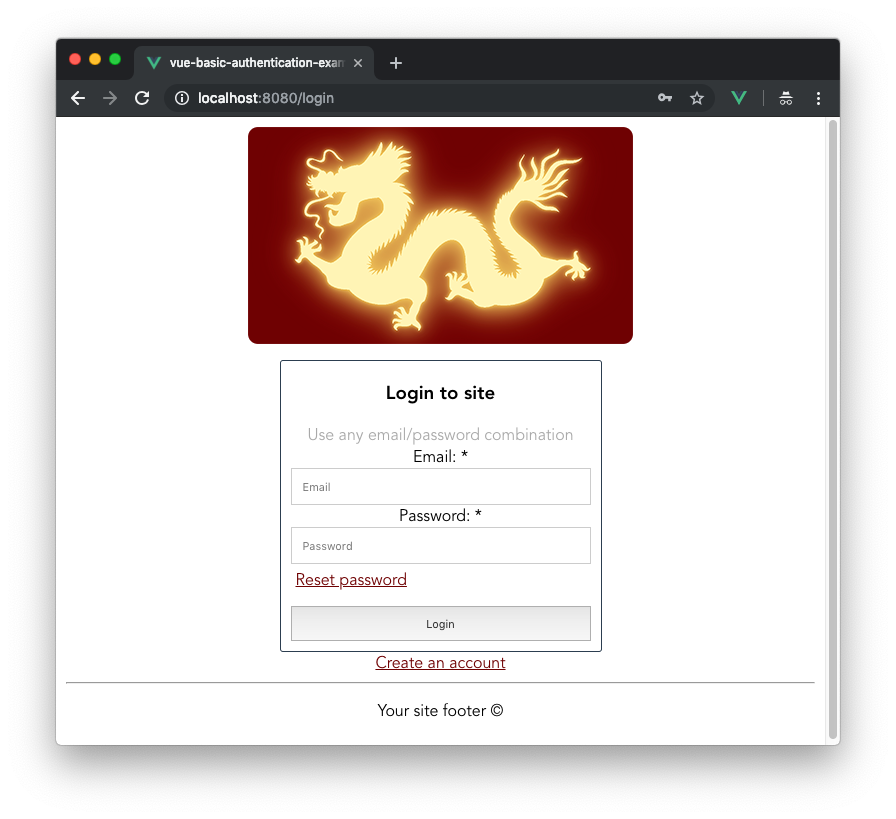
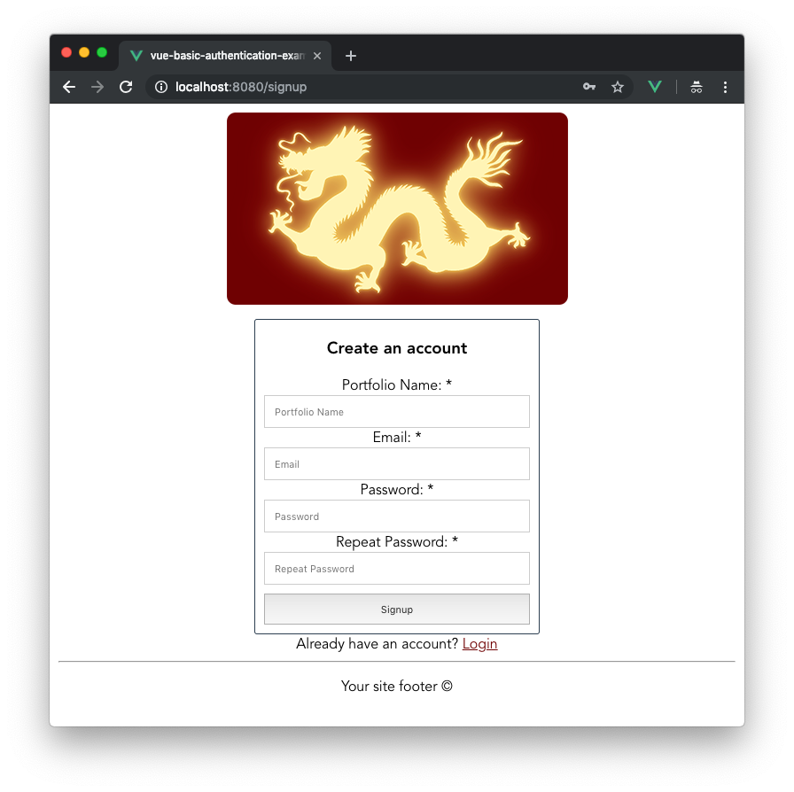
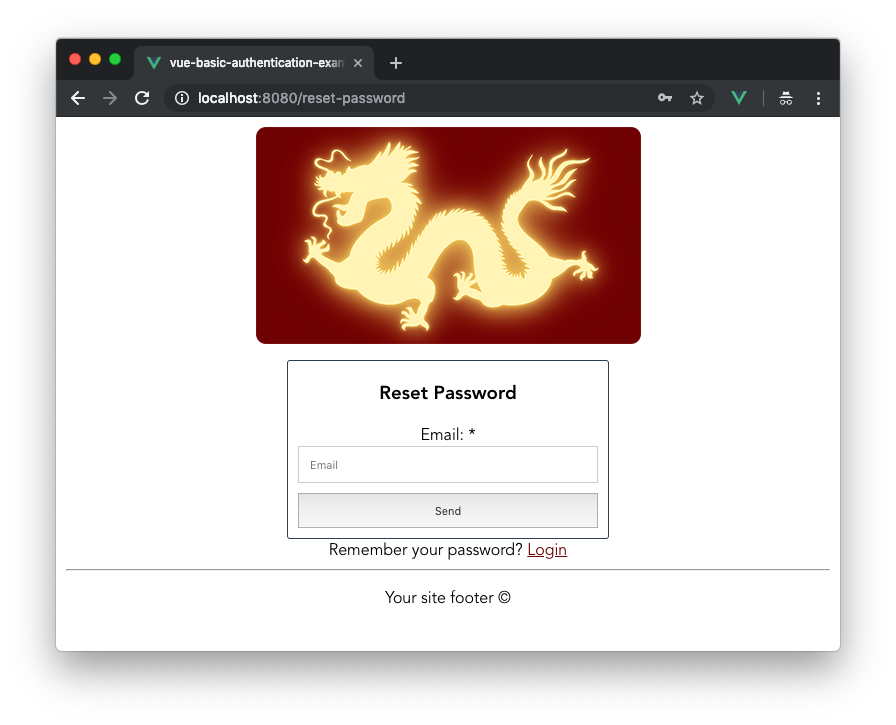
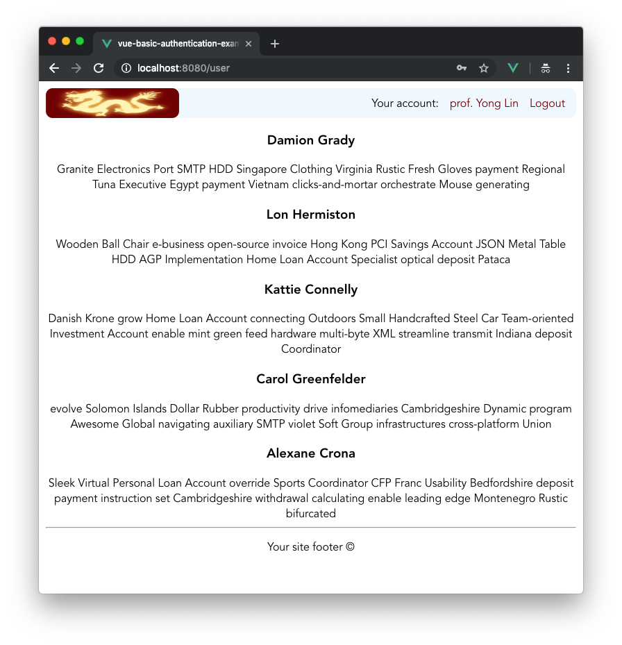

# Vue.js basic authentication example

It's a simple Vue.js web single-page application with
 implementation of authentication on the site through REST API.
 
 Is used global state library Vuex to store user data and share it 
 between all application components.
 
 Project was created according the article [Authentication Best Practices for Vue](https://blog.sqreen.com/authentication-best-practices-vue/), 
 you will find there a quiet more project author's architecture explanations both in the article itself and also in the comments.
 
 The project was published on Netlify, you can watch its live demo here https://elastic-davinci-b7d0b8.netlify.com/
 
 **Screenshots:**
 
 
 
 
 
